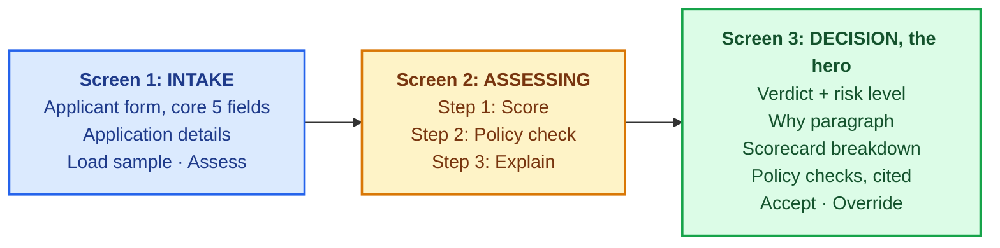
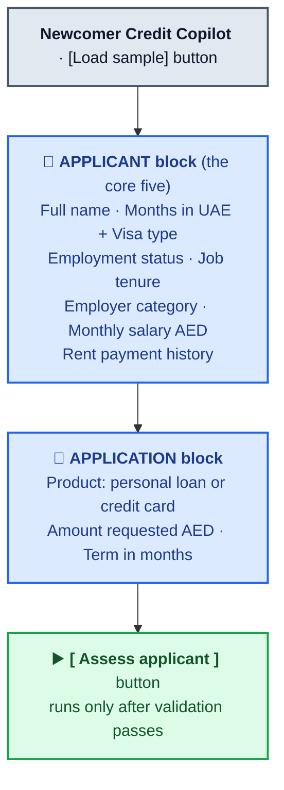
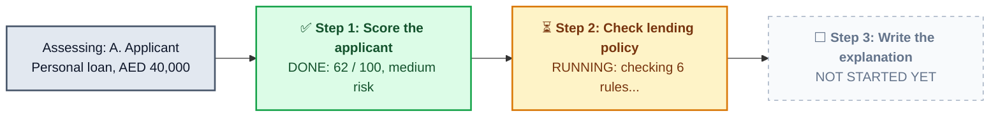
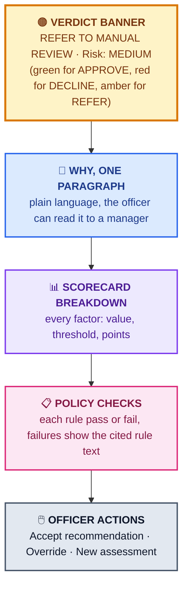

# Phase 2 Deliverable 1: End-to-End UI Flow

The full credit-officer journey, screen by screen. This is the brief's review milestone for
Phase 2, and per the brief it can change later (Phase 3 build reality may adjust details).
Written 2026-06-10. Decisions behind it: U1-U4 in `../working/phase-2-plan.md`.

**The product in one line, for orientation:** a credit officer at a UAE digital bank enters a
newcomer applicant's details, the system scores the risk, checks lending policy, and returns an
APPROVE / DECLINE / REFER recommendation with an explanation the officer can defend. The human
makes the final call (decision D2).

**The user:** one credit officer, not technical, internal tool, no login (cut list). One
assessment per session, no saved history.

---

## The journey at a glance

Three screens, one direction. The officer never needs to navigate sideways. The decision screen
is deliberately the richest one: the explanation and decision-reasoning layer is the showcase of
this product (decision D9).

---

## Screen 1: Intake

**Job:** capture one newcomer applicant accurately, fast, with no training needed.

Dropdowns wherever a field has known options (visa type, employment status, employer category,
rent history), free text or number only where it must be (name, salary, amounts). Less typing,
fewer input mistakes.

**The input fields (decision M1, the core five):**

| Field | Format | Why it is on the form |
|---|---|---|
| Monthly salary (AED) | number | Core capacity-to-repay signal. Industry standard (AECB itself holds salary data). |
| Employment status + job tenure | dropdown + number | Income stability. Short tenure is the newcomer reality, the scorecard handles it rather than auto-failing it. |
| Employer category | dropdown (government, mainland private, free zone, SME, other) | Real UAE underwriting signal: employer stability tiers. |
| Months in UAE + visa type | number + dropdown | Defines the newcomer segment and residency standing. |
| Rent payment history | dropdown (on time 6+ months, on time under 6 months, late payments, no rent history) | Alt-data standing in for the missing credit file. Officer-entered from applicant documents. This does NOT come from AECB or Ejari (not live there, verified Phase 1). |

Application details (product, amount, term) are about the request, not the person, so they sit in
their own block. One product per assessment (decision D3).

**Behaviors:**
- **Load sample:** fills the form with one of the prepared synthetic profiles (clean approve,
  borderline refer, policy-fail). Exists for the demo and for evals. Synthetic data only, no real
  personal data (cut list).
- **Validation before anything runs:** required fields present, salary and amount are positive
  numbers, term within product limits. Errors show inline next to the field. Nothing is sent
  until the form is valid, so a bad demo input cannot produce a confusing AI answer.
- **Assess applicant:** moves to Screen 2 and starts the assessment.

---

## Screen 2: Assessment in progress

**Job:** show the system working, step by step, so the officer (and a demo audience) can see the
reasoning architecture instead of a spinner. This screen IS the agent made visible (decision U2):
the fixed 3-step flow, score then policy check then explain.

A snapshot of the screen mid-assessment (step 1 finished, step 2 running, step 3 has not
started yet):

On the real screen the three steps stack vertically as a checklist. Each starts grey (not
started), turns amber while running, and turns green with a one-line result when done.

**Behaviors:**
- Each step ticks from pending to busy to done, with a one-line result when done (the score and
  band for step 1, rules passed/failed count for step 2).
- Total time should sit well inside the 15-second latency target (generous on purpose, Phase 1
  Q4: an officer reviewing an application can wait a few seconds).
- **Slow state:** if a step runs past roughly 10 seconds, show "taking longer than usual, still
  working" under it. No silent hang.
- **Failure state:** if the LLM call fails outright, say so plainly ("could not complete the
  assessment, nothing was decided, try again") with a retry button. The system never invents a
  result to cover an error.
- No officer action needed here; it advances to Screen 3 on completion.

---

## Screen 3: Decision (the hero screen)

**Job:** give the officer a recommendation they can act on and defend, with every claim
traceable. Ordered by what the officer needs first.

The screen is five blocks, top to bottom:

**Worked example (a borderline REFER case), exactly as the officer would see it:**

> **RECOMMENDATION: REFER TO MANUAL REVIEW · Risk: MEDIUM**
>
> **Why (read this to your manager):** The applicant earns a stable salary above the product
> minimum and has paid rent on time for 8 months, but has been in the UAE for only 4 months and
> in the current job for 3. Income is adequate; tenure is too short to confirm stability.
> Recommend manual review of employment contract and bank statements before a final decision.

**Scorecard (62 / 100, medium):**

| Factor | Value | Threshold | Points |
|---|---|---|---|
| Monthly salary | AED 12,000 | >= 8,000 | 20/20 |
| Job tenure | 3 months | >= 6 months | 5/20 |
| Employer category | Free zone | tiered | 12/20 |
| Months in UAE | 4 | >= 6 | 8/20 |
| Rent history | On time, 8 months | on time 6+ | 17/20 |

**Policy checks (5 of 6 passed):**

- ✅ Minimum salary for personal loan (rule 1)
- ✅ Debt burden ratio within cap (rule 2)
- ❌ **Minimum employment tenure (rule 4):** "Applicants must show 6 months of continuous
  employment" (Lending Policy, section 2.3)
- ... each check expandable to show the cited rule text

**Action row:** [ Accept recommendation ] [ Override ] [ New assessment ]

**The four blocks, and why each exists:**

1. **Verdict banner:** APPROVE / DECLINE / REFER (decision D8) plus risk level. Color-coded
   (green / red / amber). REFER is a first-class outcome, not an error: it is the system saying
   "borderline, a human should look", which is the honest behavior for a conservative v1
   (decision D6).
2. **Why, in one paragraph:** plain language, formal structure (decision U3), written so the
   officer can read it aloud to a manager or compliance. It may cite only facts present in the
   applicant data and the policy rules: this is the hallucination metric (<2%, target zero
   invented facts) made visible.
3. **Scorecard breakdown:** every factor, the applicant's value, the threshold, the points
   (decision M3: numeric, mapped to low / medium / high). Nothing hidden, no black box. This is
   the transparent judgmental scorecard (decision D7) on screen.
4. **Policy checks with citations:** each rule pass/fail, failures always expanded with the
   rule's actual text and its section reference. This is the 100% policy-grounding metric
   (every cited rule traceable to the policy document) made visible.

**Officer actions (decision U4, D2):**
- **Accept recommendation:** confirms the human decision matches the system's. Shown on screen
  as recorded; nothing persists between sessions (cut list).
- **Override:** the officer picks a different outcome and must type a one-line reason. The
  human-makes-the-final-call decision (D2) as a working control, not a slogan.
- **New assessment:** clears everything, back to Screen 1.

---

## Edge cases the flow handles (designed in, not patched later)

| Case | What the officer sees |
|---|---|
| REFER outcome | Amber verdict, explanation states exactly what is uncertain and what to verify manually (as in the wireframe above). |
| Good score but a policy rule fails | Policy gates the score: verdict is DECLINE or REFER per the rule's severity, the failed rule is cited in the Why paragraph. Proves policy is a real gate, not decoration. |
| Invalid or missing input | Caught on Screen 1 by validation, inline messages, nothing runs. |
| LLM slow | Screen 2 "taking longer than usual" state. |
| LLM failure | Screen 2 plain failure message + retry. No fabricated result, no silent hang. |

---

## What this flow deliberately does not have (cut list, Phase 1)

No login or accounts. No case queue or saved history (one assessment per session). No
applicant-facing screens (officer-only, decision D5). One loan product per assessment. English
only. Web only. These are engineering-scaffolding cuts; the credit substance on the three
screens is real (decision D9).

---

## Traceability check (every block earns its place)

| Screen element | Comes from |
|---|---|
| Three-screen shape | U1 (Monika, 2026-06-10) |
| Core five input fields | M1 (Monika, 2026-06-10) |
| Visible 3-step agent | U2; fixed agent flow score -> policy -> explain (Step 4c) |
| APPROVE / DECLINE / REFER | D8 |
| Conservative REFER behavior | D6 (avoid bad loans) |
| Why paragraph, facts-only | Hallucination metric <2% |
| Scorecard table | D7 (transparent judgmental scorecard), M3 |
| Policy citations | Policy-grounding metric, 100% traceable |
| Accept / Override row | D2 (human makes the final call), U4 |
| Synthetic sample profiles | Cut list (no real personal data); also feeds Phase 4 evals |

Next deliverable: the data model behind these screens (`02-data-model.md`), designed after this
flow per the brief's ordering.
