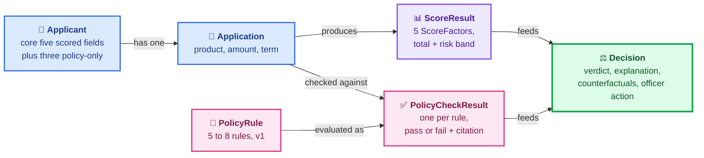
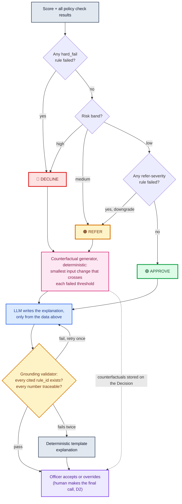

# Phase 2 Deliverable 2: First-Pass Data Model

The entities and relationships behind the UI flow, designed after the flow was set (the brief's
required ordering). First pass, per the brief's own words: Phase 3 build may adjust field
details. Written 2026-06-10, revised 2026-06-11 per Monika's review (M4, M6).

**A note on "data model" for this product:** v1 keeps no database (cut list: one assessment per
session, no saved history). The data model still matters: it defines every shape the app passes
between the form, the scoring step, the policy check, the LLM explanation step, and the decision
screen. In Phase 3 these entities become the code's data structures, and any of them could be
given a database table later without redesign.

---

## The entities at a glance

In one sentence: an Applicant has one Application; the Application produces one ScoreResult
(made of ScoreFactors) and one PolicyCheckResult per PolicyRule; the ScoreResult and the
PolicyCheckResults together produce one Decision.

---

## Entity 1: Applicant

The synthetic person being assessed. Fields are exactly the intake form's applicant block
(decision M1, the core five, plus identity basics, plus three policy-only inputs added at the
2026-06-11 review, decision M4).

| Field | Type | Notes |
|---|---|---|
| full_name | text | Display only, never a scoring input. |
| months_in_uae | number | Core newcomer-segment field. |
| visa_type | enum: employment, golden, green, other | Residency standing. |
| employment_status | enum: employed, self_employed, unemployed | |
| job_tenure_months | number | |
| employer_category | enum: government, mainland_private, free_zone, sme, other | UAE employer-stability tiers. |
| monthly_salary_aed | number | |
| rent_history | enum: on_time_6plus, on_time_under_6, late_payments, none | Officer-entered from applicant documents. NOT sourced from AECB or Ejari (rent reporting there is emerging only, verified Phase 1). |
| existing_monthly_obligations_aed | number | Policy input only, never scored. Officer-entered, defaults to 0 under the stated assumption that a newcomer carries zero UAE debt unless documented. Feeds rule 2 (debt burden ratio) only. |
| age_years | number | Policy input only, never scored. Feeds rule 3 (age at maturity) only. |
| visa_months_remaining | number | Policy input only, never scored. Officer-entered from the visa. Feeds rule 5 (residency term) only. |

The scorecard is unchanged by these three additions: it still uses exactly the five M1 factors,
and the policy-only fields can never move the score (M4).

Deliberately absent, by Phase 1 decision: remittance data (do-not-claim list), home-country
credit standing (overlaps Nova Credit; our positioning serves applicants Nova does not cover),
education level (weak signal, cut under the accuracy standard). Synthetic profiles only; no real
personal data exists anywhere in the system.

## Entity 2: Application

What the applicant is asking for. Separate from Applicant because the same person could, in a
future version, apply for different products.

| Field | Type | Notes |
|---|---|---|
| product | enum: personal_loan, credit_card | One product per assessment (D3). |
| amount_aed | number | |
| term_months | number | Within product limits, enforced by form validation. |

## Entity 3: ScoreFactor and ScoreResult

The transparent judgmental scorecard (D7), one ScoreFactor per input field. This is the entity
the scorecard table on the decision screen renders directly.

**ScoreFactor (one per scored field, 5 in v1):**

| Field | Type | Notes |
|---|---|---|
| factor_name | text | e.g. "Monthly salary". |
| applicant_value | text | The value as entered, e.g. "AED 12,000". |
| threshold | text | The rule it was judged against, e.g. ">= 8,000". |
| points_awarded | number | 0 to 20 in v1 (5 factors x 20 = 100). |
| rationale | text | One line, e.g. "salary comfortably above product minimum". |

**ScoreResult (one per assessment):**

| Field | Type | Notes |
|---|---|---|
| factors | list of ScoreFactor | Always all 5, never silently skipped. |
| total_points | number | Sum, 0 to 100 (M3: numeric). |
| risk_band | enum: low, medium, high | Mapped from total_points by fixed cut-offs set in Phase 3 (M3). |

## Entity 4: PolicyRule

One lending-policy rule the applicant is checked against. The set of these IS the policy
document the RAG step grounds on. v1 ships 5 to 8 rules (decision M2): few enough to keep every
one real and testable, enough to make the policy gate meaningful.

| Field | Type | Notes |
|---|---|---|
| rule_id | text | e.g. "rule-4". |
| title | text | e.g. "Minimum employment tenure". |
| rule_text | text | The exact sentence the decision screen cites. The 100% policy-grounding metric requires every citation to trace back to this field verbatim. |
| source_section | text | e.g. "Lending Policy, section 2.3". |
| condition | text (machine-checkable) | The check, e.g. job_tenure_months >= 6. |
| severity | enum: hard_fail, refer | hard_fail forces DECLINE. refer downgrades an automatic approve to refer; it never rescues a failing score. How a good score gets gated by policy. |

**Candidate v1 rule list (rewritten at the 2026-06-11 review so every condition is
machine-checkable against the entities above; names in CAPS are constants whose values are set
in Phase 3):**

| # | Rule | Machine-checkable condition | Severity |
|---|---|---|---|
| 1 | Minimum salary for the product | monthly_salary_aed >= PRODUCT_MIN_SALARY | hard_fail |
| 2 | Debt burden ratio cap | (existing_monthly_obligations_aed + new_installment) / monthly_salary_aed <= 0.50, where new_installment = amount_aed * (1 + FLAT_ANNUAL_RATE * term_months / 12) / term_months. The 50 percent cap is the UAE-standard debt burden ratio. | hard_fail |
| 3 | Maximum age at loan maturity | age_years + term_months / 12 <= 65 | hard_fail |
| 4 | Minimum employment tenure | job_tenure_months >= 6 (unchanged from the first draft) | refer |
| 5 | Valid residency for the loan term | visa_months_remaining >= term_months | refer |
| 6 | Maximum loan amount as a multiple of salary | amount_aed <= AMOUNT_SALARY_MULTIPLE * monthly_salary_aed | hard_fail |
| 7 | (optional) Salary must be received in a bank account, not cash | Unchanged from the first draft; no v1 field backs it yet, keep or cut in Phase 3. | hard_fail if kept |

Severities are product decisions: refer means the rule blocks an automatic approve but never
rescues a failing score.

Named constants: PRODUCT_MIN_SALARY (per product), FLAT_ANNUAL_RATE (the flat annual interest
rate, used here only to estimate the installment for the debt burden check), and
AMOUNT_SALARY_MULTIPLE. Their values are set in Phase 3.

## Entity 5: PolicyCheckResult

The outcome of checking one PolicyRule against this Application. One per rule, every rule
checked every time, no silent skips.

| Field | Type | Notes |
|---|---|---|
| rule_id | text | Links to the PolicyRule. |
| passed | boolean | |
| cited_text | text | Copied from PolicyRule.rule_text, shown on the decision screen for failures. |
| finding | text | One line, e.g. "tenure is 3 months, rule requires 6". |

## Entity 6: Decision

What the decision screen renders. Produced from the ScoreResult plus all PolicyCheckResults, by
the system, then finalized by the officer (D2).

| Field | Type | Notes |
|---|---|---|
| recommendation | enum: approve, decline, refer | D8. Policy severity can cap it regardless of score. |
| risk_band | enum: low, medium, high | Carried from ScoreResult. |
| explanation | text | The Why paragraph. May reference ONLY applicant fields, score factors, and cited policy text (hallucination metric: zero invented facts). |
| reasons | list of text | Bullet-form drivers of the outcome. |
| counterfactuals | list of text | Populated only for decline or refer, empty for approve. Generated deterministically from the failed thresholds (the smallest input change that crosses each one), never by the LLM. |
| score_result | ScoreResult | Embedded, for traceability. |
| policy_results | list of PolicyCheckResult | Embedded, for traceability. |
| officer_action | enum: accepted, overridden, none | U4. Set when the officer clicks. |
| override_reason | text, required if overridden | The human's stated reason (D2 made concrete). |

Traceability is structural on purpose: the Decision physically contains the score and policy
results it claims to rest on, so the explanation can be checked against them line by line. That
is what Phase 4's evals will do.

---

## How a decision is derived (the relationships in action)

1. Officer submits Applicant + Application (Screen 1, validated).
2. Scoring step turns the 5 applicant fields into 5 ScoreFactors, sums to a ScoreResult.
3. Policy step evaluates every PolicyRule condition, producing one PolicyCheckResult each.
4. Combination logic (the diagram below): any hard_fail rule failed means DECLINE. Otherwise
   the risk band maps to the recommendation: high means DECLINE, medium means REFER, low means
   APPROVE, unless any refer-severity rule failed, in which case the approve becomes REFER.
   The principle: a refer-severity failure downgrades an approve to refer, it never upgrades a
   decline, conservative per D6.
5. Counterfactual step (deterministic): for a decline or refer, compute the smallest input
   change that crosses each failed threshold (for example, "reaching 6 months tenure clears
   rule 4"). These become Decision.counterfactuals; an approve gets an empty list.
6. The LLM writes the explanation and reasons from (and only from) the data above, including
   the counterfactuals.
7. Grounding validator (deterministic): every rule_id the explanation cites must exist in the
   policy check results, and every number it states must exist in the inputs or the score
   output. On failure the LLM retries once; if the retry also fails, a deterministic template
   explanation is used instead. The officer never sees ungrounded text.
8. The officer accepts or overrides; the Decision records it. Session ends, nothing persists.

---

## Held for later (so the first pass stays first-pass)

- Exact point weights, band cut-offs, and final rule text: Phase 3 build.
- Persistence (decision history table, audit log): valid v2, deliberately cut from v1.
- A second loan product, applicant-facing entities, user accounts: v2, per the cut list.
